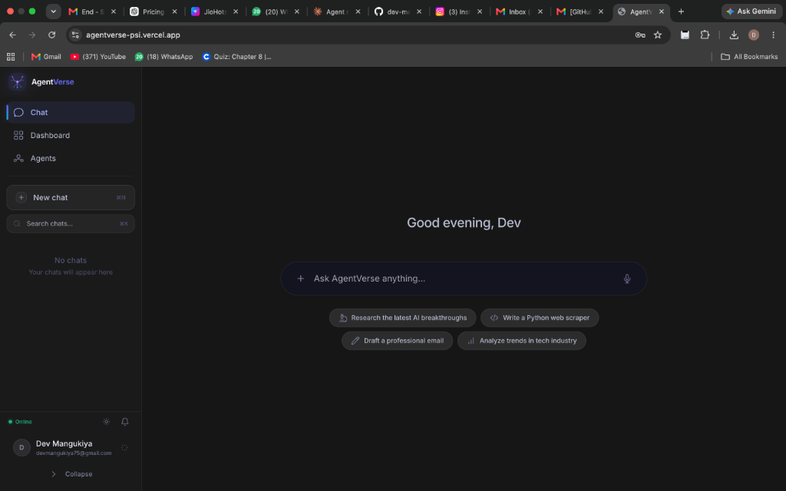
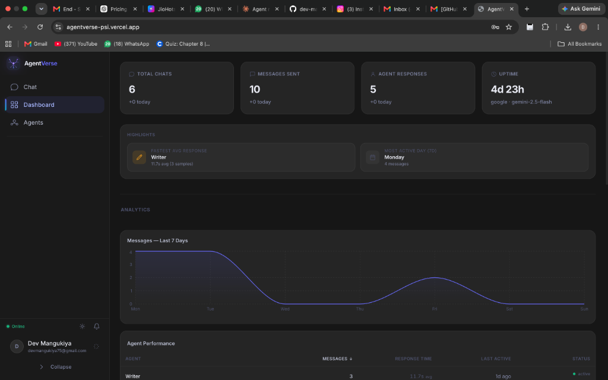
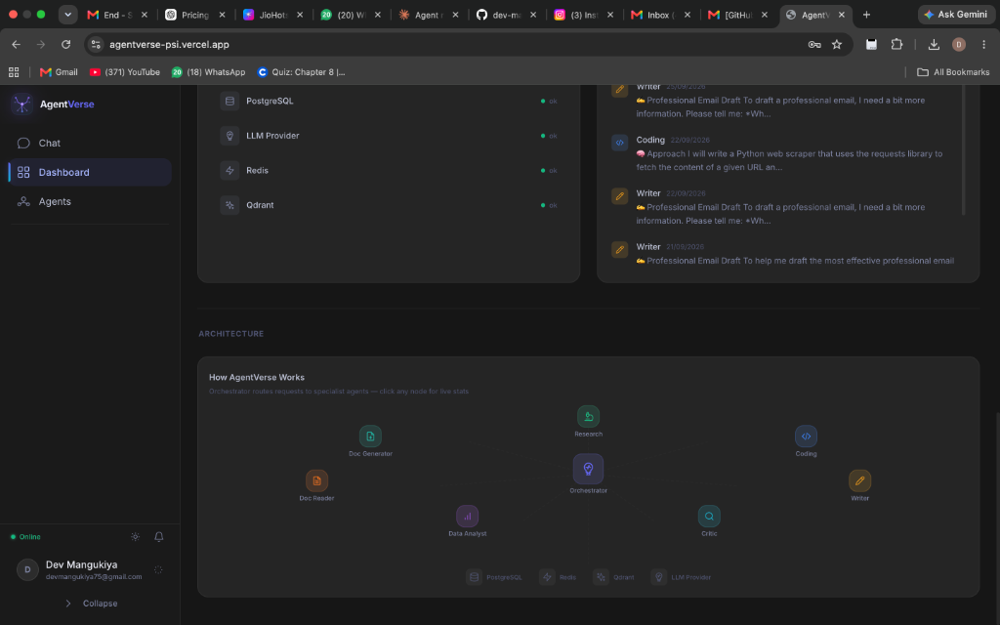
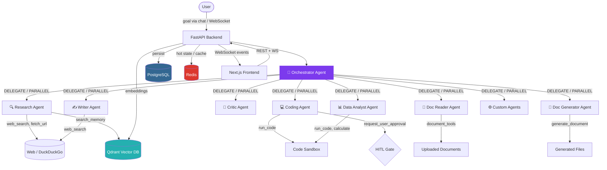

<div align="center">

# 🌐 AgentVerse

**An autonomous multi-agent AI workforce with real-time orchestration observability.**

[](https://nextjs.org/)
[](https://fastapi.tiangolo.com/)
[](https://langchain-ai.github.io/langgraph/)
[](https://www.postgresql.org/)
[](https://redis.io/)
[](https://qdrant.tech/)
[](https://python.org/)
[](https://typescriptlang.org/)
[](https://agentverse-psi.vercel.app)

[Live Demo](https://agentverse-psi.vercel.app) · [Architecture Deep Dive](docs/ARCHITECTURE.md) · [Roadmap](docs/PHASES.md)

</div>

---

## Overview

AgentVerse is a full-stack platform where an **Orchestrator agent** receives any user goal, decomposes it into a structured plan, and delegates tasks to a roster of **8 specialist agents** — all while the frontend renders the entire pipeline in real-time via WebSocket. Every delegation, tool call, and quality evaluation is visible in a live execution feed and an interactive agent network graph, turning what would normally be a black-box AI response into an observable, inspectable system.

The project combines a **FastAPI + LangGraph** backend (with three-tier storage: Postgres for state, Redis for hot cache, Qdrant for semantic memory) with a **Next.js 14** frontend built around Framer Motion animations, React Flow network graphs, and Recharts analytics dashboards.

---

## Features

> Only features that exist in the actual codebase are listed here.

| Category | Feature | Details |
|---|---|---|
| 🤖 **Multi-Agent Orchestration** | Parallel & serial delegation | Orchestrator decomposes goals and delegates via `DELEGATE:` or `PARALLEL:` directives to multiple specialists simultaneously |
| 🔬 **8 Specialist Agents** | Research, Coding, Writer, Critic, Data Analyst, Doc Reader, Doc Generator, + Custom | Each with dedicated tools, system prompts, and output formatting |
| 🏗️ **Custom Agent Builder** | Create agents from the UI | Define name, emoji, system prompt, tools, and model override — persisted to the database |
| 🛡️ **Secure Code Sandbox** | Python, JavaScript, Bash | Isolated temp-directory execution with 30s timeout, blocked dangerous imports, and output size limits |
| 🔄 **Real-Time Pipeline View** | WebSocket event streaming | Every agent activation, tool call, and completion streams live to a visual pipeline timeline |
| 🕸️ **Agent Network Graph** | Interactive topology map | Force-directed graph (React Flow) showing agents, delegation edges, and live status pulses |
| 📊 **Analytics Dashboard** | KPIs, agent analytics, leaderboard | Conversation counts, agent usage stats, feedback approval rates, system health indicators |
| 👤 **Human-in-the-Loop (HITL)** | Approve/reject sensitive actions | Agents request explicit user approval before executing destructive operations; UI renders approve/reject modal |
| 🎤 **Voice Input** | Web Speech API dictation | Click-to-dictate in the chat input using the browser's built-in SpeechRecognition API |
| 📁 **File Upload & Document Analysis** | PDF, text, DOCX parsing | Upload documents in-chat; Doc Reader agent extracts and answers questions about content |
| 📄 **Document Generation** | Downloadable DOCX, PDF, XLSX, HTML, Markdown | Doc Generator agent creates formatted documents with download links |
| 🔍 **Web Search & Fetch** | DuckDuckGo + Trafilatura | Research agent searches the web, fetches full article text, and cites sources with zero-hallucination rules |
| 🧠 **Semantic Memory (RAG)** | Qdrant vector store | Long-term memory via embeddings; agents can `search_memory` for past conversations and documents |
| 🔐 **Authentication** | Email/password + Google Sign-In | JWT-based auth with optional anonymous sessions; OAuth via Google Identity Services |
| 💬 **Conversation Management** | History, pinning, export | Persistent chat history, pinnable conversations, export to Markdown/JSON/TXT |
| ⌨️ **Command Palette & Shortcuts** | Keyboard-driven navigation | Power-user command palette and keyboard shortcut overlay |
| 🔗 **Third-Party Integrations** | GitHub, Linear, Slack | Search GitHub repos, create Linear issues, send Slack messages — all as agent tools |
| ⚡ **LLM Provider Flexibility** | Multi-provider with auto-fallback | Supports Google Gemini (with round-robin key rotation), Anthropic Claude, OpenAI GPT, and HuggingFace models |
| 📝 **Prompt Templates** | Pre-built starter prompts | Category-organized templates for common tasks (research, code, analysis, writing) |
| ❤️ **Feedback & Critic Review** | Thumbs up/down + quality scoring | Per-message feedback; Critic agent outputs structured 1–10 scores with pass/fail verdicts |
| 🌓 **Theme Support** | Dark/light mode | System-aware theme switching with CSS custom properties |

---

## Screenshots

<div align="center">

### Chat Interface


<br>

### Analytics Dashboard  


<br>

### System Health & Agent Network


</div>

---

## Architecture

The following diagram reflects the **actual agent topology** confirmed from the codebase:



### Data Flow

1. **User submits a goal** via chat → WebSocket or REST to FastAPI
2. **Orchestrator** analyzes the goal and emits `DELEGATE:` or `PARALLEL:` directives
3. **Specialist agents** execute with their dedicated tools, emitting progress events over WebSocket
4. **Critic agent** evaluates output quality (1–10 score); below threshold triggers retry (up to `MAX_RETRIES=2`)
5. **Results stream live** to the frontend's pipeline view, activity feed, and chat
6. **Conversations, messages, and task executions** persist to PostgreSQL
7. **Semantic memory** (summaries, embeddings) saved to Qdrant for future RAG retrieval
8. **Redis** provides hot-state caching, rate limiting, and LLM response caching

---

## Tech Stack

### Backend

| Dependency | Version | Purpose |
|---|---|---|
| FastAPI | ≥ 0.115 | Async web framework + WebSocket |
| Uvicorn | ≥ 0.30.6 | ASGI server |
| LangChain | ≥ 0.3.1 | Agent framework |
| LangGraph | ≥ 0.2.28 | State machine orchestration |
| LangChain-Anthropic | ≥ 0.2.1 | Claude provider |
| LangChain-OpenAI | ≥ 0.2.1 | GPT provider |
| LangChain-Google-GenAI | ≥ 2.0.0 | Gemini provider |
| LangChain-HuggingFace | ≥ 0.1.0 | HuggingFace provider |
| SQLAlchemy | 2.0.35 | Async ORM (PostgreSQL + SQLite) |
| Alembic | 1.13.3 | Database migrations |
| asyncpg | ≥ 0.30.0 | PostgreSQL async driver |
| aiosqlite | ≥ 0.20.0 | SQLite async driver (dev fallback) |
| Redis | 5.0.8 | Cache + hot state |
| Qdrant Client | 1.11.2 | Vector database |
| Pydantic | 2.9.2 | Validation + settings |
| structlog | 24.4.0 | Structured logging |
| Tavily | 0.5.0 | Web search (alternative) |
| ddgs | ≥ 9.5.0 | DuckDuckGo search |
| Trafilatura | ≥ 2.0.0 | Web content extraction |
| pandas | 2.2.3 | Data analysis |
| matplotlib | 3.9.2 | Visualization |
| pypdf | ≥ 5.0.0 | PDF reading |
| python-docx | ≥ 1.1.0 | DOCX reading/writing |
| fpdf2 | ≥ 2.8.0 | PDF generation |
| openpyxl | 3.1.5 | Excel generation |
| bcrypt | ≥ 4.0.0 | Password hashing |
| python-jose | 3.3.0 | JWT tokens |

### Frontend

| Dependency | Version | Purpose |
|---|---|---|
| Next.js | 14.2.5 | React framework (App Router) |
| React | 18.3.1 | UI library |
| TypeScript | 5.5.4 | Type safety |
| @xyflow/react | ^12.11.6 | Agent network graph (React Flow) |
| Framer Motion | 11.5.4 | Animations + transitions |
| Recharts | 2.12.7 | Dashboard charts |
| Zustand | 4.5.5 | State management |
| react-markdown | ^10.1.0 | Markdown rendering |
| remark-gfm | ^4.0.1 | GitHub-flavored markdown |
| Tailwind CSS | 3.4.10 | Utility-first styling |
| clsx | 2.1.1 | Conditional class names |

### Infrastructure

| Service | Image / Platform | Port |
|---|---|---|
| PostgreSQL | `postgres:16-alpine` | 5432 |
| Redis | `redis:7-alpine` | 6379 |
| Qdrant | `qdrant/qdrant:v1.11.4` | 6333, 6334 |
| Backend | `python:3.11-slim` (Dockerfile) | 8000 |
| Frontend | Next.js standalone | 3000 |

---

## Getting Started

### Prerequisites

- **Node.js** ≥ 18 and **npm**
- **Python** 3.11+
- **Docker** & **Docker Compose** (for infrastructure services)
- At least one LLM API key (Google, Anthropic, OpenAI, or HuggingFace)

### 1. Clone the repository

```bash
git clone https://github.com/dev-mangukiya/agentverse.git
cd agentverse
```

### 2. Set up environment variables

```bash
cp .env.example .env
# Edit .env and add your API keys (at minimum, one LLM provider key)
```

### 3. Start infrastructure services

```bash
docker compose -f docker/docker-compose.yml up -d postgres redis qdrant
```

This starts PostgreSQL (`:5432`), Redis (`:6379`), and Qdrant (`:6333`).

### 4. Start the backend

```bash
cd backend
python -m venv venv
source venv/bin/activate          # Windows: venv\Scripts\activate
pip install -r requirements.txt

uvicorn app.main:app --reload --port 8000
```

The backend auto-creates database tables on startup and pings all backing services.
Verify at: [http://localhost:8000/health](http://localhost:8000/health)

### 5. Start the frontend

```bash
cd frontend
npm install
npm run dev
```

Open [http://localhost:3000](http://localhost:3000).

### Alternative: Full Docker Compose

To run everything (including backend + frontend) in containers:

```bash
docker compose -f docker/docker-compose.yml up --build
```

---

## Environment Variables

All variables are sourced from `.env` at the repo root. See [`.env.example`](.env.example) for the full template.

| Variable | Required | Default | Description |
|---|---|---|---|
| `ANTHROPIC_API_KEY` | One LLM key required | — | Anthropic Claude API key |
| `OPENAI_API_KEY` | One LLM key required | — | OpenAI API key |
| `GOOGLE_API_KEY` | One LLM key required | — | Google Gemini API key |
| `GOOGLE_API_KEYS` | No | — | Comma-separated Gemini keys for round-robin rotation |
| `HUGGINGFACE_API_KEY` | No | — | HuggingFace Hub API token |
| `DEFAULT_MODEL_PROVIDER` | No | `google` | LLM provider: `google`, `anthropic`, `openai`, `huggingface` |
| `DEFAULT_MODEL` | No | `gemini-2.5-flash` | Model name for the chosen provider |
| `DATABASE_URL` | No | SQLite (auto) | PostgreSQL connection string (e.g. `postgresql+asyncpg://...`) |
| `REDIS_URL` | No | `redis://localhost:6379/0` | Redis connection URL |
| `QDRANT_URL` | No | `http://localhost:6333` | Qdrant server URL |
| `QDRANT_COLLECTION` | No | `agentverse_memory` | Qdrant collection name |
| `TAVILY_API_KEY` | No | — | Tavily web search key (optional; DuckDuckGo is the default) |
| `SECRET_KEY` | Yes (prod) | `change-me` | JWT signing secret |
| `JWT_ALGORITHM` | No | `HS256` | JWT algorithm |
| `JWT_EXPIRE_MINUTES` | No | `1440` | JWT token expiry (24h default) |
| `GOOGLE_OAUTH_CLIENT_ID` | No | — | Google Sign-In OAuth client ID |
| `MAX_RETRIES` | No | `2` | Agent retry count on Critic failure |
| `MAX_PLAN_STEPS` | No | `10` | Max tasks per plan |
| `CRITIC_PASS_THRESHOLD` | No | `0.75` | Critic score threshold (0–1) |
| `NEXT_PUBLIC_API_URL` | No | `http://localhost:8000` | Backend URL for the frontend |
| `NEXT_PUBLIC_WS_URL` | No | `ws://localhost:8000/ws` | WebSocket URL for the frontend |

---

## Project Structure

```
agentverse/
├── .env.example                  # Environment variable template
├── .github/workflows/
│   └── keep-alive.yml            # GitHub Actions cron to prevent Render cold starts
├── render.yaml                   # Render.com IaC deployment blueprint
├── docker/
│   ├── docker-compose.yml        # Full-stack Compose (Postgres, Redis, Qdrant, Backend, Frontend)
│   ├── Dockerfile.backend        # Backend container image
│   └── Dockerfile.frontend       # Frontend container image
├── docs/
│   ├── ARCHITECTURE.md           # Detailed architecture deep dive
│   └── PHASES.md                 # Build roadmap with phase checklist
├── backend/
│   ├── Dockerfile                # Production backend image (used by Render)
│   ├── requirements.txt          # Python dependencies
│   └── app/
│       ├── main.py               # FastAPI app factory, lifespan, middleware, routers
│       ├── agents/
│       │   ├── base.py           # BaseAgent class, LLM factory, key rotation, retry logic
│       │   ├── orchestrator.py   # Orchestrator — plans & delegates to specialists
│       │   ├── research.py       # Research — web search + citation
│       │   ├── coding.py         # Coding — code generation + sandbox execution
│       │   ├── writer.py         # Writer — content creation + synthesis
│       │   ├── critic.py         # Critic — quality evaluation (1-10 scoring)
│       │   ├── data_analyst.py   # Data — analysis, statistics, visualization
│       │   ├── doc_reader.py     # Doc Reader — PDF/text document analysis & Q&A
│       │   ├── doc_generator.py  # Doc Generator — creates downloadable documents
│       │   └── custom_agent.py   # Dynamic custom agent loaded from DB
│       ├── api/routes/
│       │   ├── chat.py           # Chat REST + WebSocket (pipeline streaming, agent dispatch)
│       │   ├── stats.py          # Dashboard analytics + agent network graph data
│       │   ├── auth.py           # Register, login, Google OAuth, JWT
│       │   ├── custom_agents.py  # CRUD for user-created custom agents
│       │   ├── documents.py      # Document download endpoint
│       │   └── health.py         # Health check (pings DB, Redis, Qdrant, LLM)
│       ├── tools/
│       │   ├── tools.py          # Core tools: web_search, fetch_url, run_code, calculate, etc.
│       │   ├── code_sandbox.py   # Secure multi-language code execution sandbox
│       │   ├── document_tools.py # PDF/DOCX/XLSX/HTML generation + document reading
│       │   ├── hitl.py           # Human-in-the-loop approval tool
│       │   ├── memory_tools.py   # search_memory — semantic vector search
│       │   ├── github_tools.py   # search_github_repos
│       │   ├── linear_tools.py   # create_linear_issue
│       │   └── slack_tools.py    # send_slack_message
│       ├── core/
│       │   ├── config.py         # Pydantic Settings — all env vars in one place
│       │   ├── logging.py        # structlog configuration
│       │   └── rate_limiter.py   # Request rate limiting middleware
│       ├── database/
│       │   ├── session.py        # SQLAlchemy async engine + session factory
│       │   ├── redis_client.py   # Redis singleton with graceful degradation
│       │   └── models/
│       │       └── models.py     # ORM: User, Conversation, Message, TaskExecution, CustomAgent
│       └── memory/
│           └── vector_store.py   # Qdrant client, collection management, embedding storage
└── frontend/
    ├── package.json              # Dependencies + scripts (dev, build, start, lint)
    ├── vercel.json               # Vercel deployment config
    ├── next.config.js            # Next.js config (standalone output)
    ├── tailwind.config.ts        # Tailwind theme + custom design tokens
    ├── app/
    │   ├── layout.tsx            # Root layout + providers
    │   ├── page.tsx              # Main SPA — view switching (Chat, Dashboard, Agents)
    │   └── globals.css           # Global styles + CSS custom properties
    ├── components/
    │   ├── chat/
    │   │   ├── ChatPanel.tsx     # Main chat: message input, voice dictation, file upload, WS streaming
    │   │   ├── ChatHistory.tsx   # Conversation list, pinning, search
    │   │   ├── MarkdownRenderer.tsx # Renders agent output with syntax highlighting
    │   │   ├── ExportMenu.tsx    # Export conversations to MD/JSON/TXT
    │   │   ├── FileManager.tsx   # Drag-and-drop file upload manager
    │   │   └── PromptTemplates.tsx # Category-organized starter prompt library
    │   ├── agents/
    │   │   ├── AgentNetworkGraph.tsx # Interactive React Flow network topology
    │   │   ├── AgentPipeline.tsx # Live execution pipeline timeline
    │   │   ├── AgentBuilder.tsx  # UI for creating custom agents
    │   │   ├── AgentComparison.tsx # Side-by-side agent performance comparison
    │   │   └── AgentCard.tsx     # Individual agent status card
    │   ├── dashboard/
    │   │   ├── KPICards.tsx      # Key metrics (conversations, messages, uptime)
    │   │   ├── AgentAnalytics.tsx # Agent usage charts + breakdowns
    │   │   ├── FeedbackLeaderboard.tsx # Agent ranking by approval rate
    │   │   ├── ActivityFeed.tsx  # Real-time activity stream
    │   │   ├── SystemHealth.tsx  # Service health status panel
    │   │   ├── ArchitectureOverview.tsx # Visual system architecture diagram
    │   │   └── DashboardHighlights.tsx # At-a-glance highlights
    │   ├── auth/
    │   │   ├── AuthModal.tsx     # Login/register modal + Google Sign-In
    │   │   └── WelcomeModal.tsx  # First-visit onboarding modal
    │   ├── layout/
    │   │   ├── Sidebar.tsx       # Navigation sidebar with view switching
    │   │   ├── Header.tsx        # Top bar with status, theme, notifications
    │   │   ├── CommandPalette.tsx # ⌘K command palette for quick navigation
    │   │   └── ShortcutsOverlay.tsx # Keyboard shortcut reference overlay
    │   ├── notifications/
    │   │   ├── NotificationCenter.tsx # Notification panel
    │   │   └── NotificationProvider.tsx # Notification context + state
    │   ├── brand/
    │   │   └── AgentVerseLogo.tsx # Animated brand logo
    │   └── icons/
    │       └── Icons.tsx         # SVG icon components
    ├── hooks/
    │   ├── useKeepAlive.ts       # Silent backend heartbeat (prevents Render cold starts)
    │   └── useKeyboardShortcuts.ts # Global keyboard shortcut bindings
    ├── lib/
    │   ├── auth.tsx              # Auth context + Google OAuth hooks
    │   ├── session.ts            # Session ID management
    │   └── theme.tsx             # Theme context (dark/light)
    └── config/
        ├── agents.tsx            # Agent registry (names, emojis, colors, descriptions)
        └── motion.ts             # Framer Motion animation presets
```

---

## Deployment

### Production (current)

| Service | Platform | URL |
|---|---|---|
| Frontend | Vercel | [agentverse-psi.vercel.app](https://agentverse-psi.vercel.app) |
| Backend | Render (free tier) | `agentverse-140e.onrender.com` |

The backend is kept warm via:
1. **Frontend heartbeat** — pings `/health` every 4 minutes while any tab is open
2. **GitHub Actions cron** — [keep-alive.yml](.github/workflows/keep-alive.yml) pings every ~2–4 minutes

Infrastructure-as-code config: [`render.yaml`](render.yaml)

---

## Status

This project is under **active development**. The build roadmap is tracked in [`docs/PHASES.md`](docs/PHASES.md):

- ✅ Phase 1 — Project setup & architecture
- Phases 2–8 (Backend foundation → Agent system → LangGraph workflows → RAG/memory → Frontend dashboard → Real-time visualization → Testing & deployment) are in progress

The core agent system, chat interface, dashboard, and deployment pipeline are functional. See the [ARCHITECTURE.md](docs/ARCHITECTURE.md) for a detailed design deep dive.

---

## License

<!-- ⚠️ No LICENSE file was found in the repo root. The existing README claimed MIT
     but without a LICENSE file, this is a placeholder. Add a LICENSE file to confirm. -->

MIT (assumed — add a `LICENSE` file to the repo root to make this explicit)

---

## Author

<!-- Placeholder — update with your preferred contact info -->

Built by [@dev-mangukiya](https://github.com/dev-mangukiya)

---

<div align="center">
<sub>Built with LangGraph · FastAPI · Next.js · and an unreasonable number of agents 🤖</sub>
</div>
